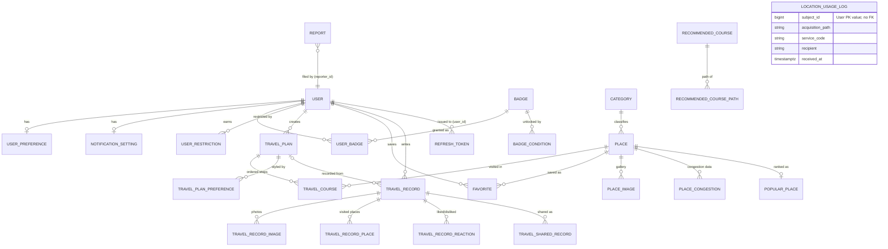

# 아키텍처

이 문서는 레이어 구조와 패키지 규칙의 **단일 기준**이다.
새 코드는 (사람이 작성하든 AI가 작성하든) 이 문서의 규칙을 따라야 하며,
규칙을 바꾸는 결정은 [ADR](adr/)로 기록한 뒤 이 문서를 갱신한다.

## 레이어 구조

```
Controller  →  Service  →  Repository  →  DB
   ↓              ↓
  DTO          Entity
```

**의존 방향은 위에서 아래로만.** Repository가 Service를, Service가 Controller를 참조하면 안 된다.
Entity는 Controller 밖으로 나가지 않는다 — API 경계에서는 항상 DTO를 사용한다.

| 레이어 | 책임 | 규칙 |
|---|---|---|
| Controller | HTTP 매핑, 입력 검증(`@Valid`), 응답 봉투 | 비즈니스 로직 금지. `ApiResponse.onSuccess(...)`만 반환 |
| Service | 비즈니스 로직, 트랜잭션 경계 | 클래스에 `@Transactional(readOnly = true)`, 쓰기 메서드에만 `@Transactional` |
| Repository | 데이터 접근 | `JpaRepository` 상속. 공간 검색은 네이티브 쿼리(`ST_DWithin`) |
| Entity | 도메인 상태 + 상태 변경 메서드 | setter 금지. `Report.approve()`처럼 의도가 드러나는 메서드로 변경 |

## 패키지 구조 (도메인별 수직 슬라이스)

기능은 기술 레이어가 아니라 **도메인 기준**으로 묶는다. 도메인 하나의 완성형:

```
domain/plan/
  controller/   TravelPlanController
  service/      TravelPlanService            (커맨드/쿼리가 커지면 CommandService/QueryService 분리)
  repository/   TravelPlanRepository
  dto/          TravelPlanRequest, TravelPlanResponse   (Java record)
  converter/    TravelPlanConverter          (entity ↔ dto 변환, static 메서드)
  entity/       TravelPlan, TravelCourse, ...
  enums/        TravelPlanStatus, ...
  exception/    PlanErrorCode                (BaseCode 구현 enum)
```

현재는 `entity`/`enums`만 존재한다. 나머지 레이어를 추가할 때 이 구조를 따른다.
공통(횡단) 관심사는 `global/`에만 둔다: 응답 봉투(`apiPayload`), 설정(`config`), `BaseEntity`.

## API 응답 규칙

모든 응답은 `ApiResponse<T>` 봉투를 사용한다: `{isSuccess, code, message, result}`.

- 성공: `ApiResponse.onSuccess(GeneralSuccessCode.REQUEST_OK, result)`
- 비즈니스 실패: `throw new GeneralException(PlanErrorCode.PLAN_NOT_FOUND)` →
  `GeneralExceptionAdvice`가 봉투로 변환한다. **컨트롤러에서 try-catch 하지 않는다.**
- 프레임워크 예외(검증 실패, 타입 불일치, DB 제약 위반 등)도 `GeneralExceptionAdvice`가
  일괄 처리한다. 새 예외 유형은 컨트롤러가 아니라 advice에 핸들러를 추가한다.

에러 코드 체계는 [ADR-0001](adr/0001-api-response-envelope.md) 참고.

## 도메인 모델 (ERD)

> ⚠️ 엔티티를 추가/변경하면 이 다이어그램을 갱신할 것. (PR 체크리스트 항목)



`Report`는 FK 없이 `targetType(RECORD/PHOTO/USER) + targetId`로 다형 참조한다.
`LocationUsageLog.subjectId`도 사용자 탈퇴 후 보존을 위해 User 연관관계와 FK 없이 PK 값만 저장한다.

## 주요 설계 결정 (요약 — 상세는 ADR)

| 결정 | 내용 | ADR |
|---|---|---|
| 응답 봉투 | `ApiResponse` + `BaseCode` enum 체계 | [0001](adr/0001-api-response-envelope.md) |
| 공간 데이터 | `Place`에 lat/lng(BigDecimal)와 PostGIS `geom` **이중 저장** — 항상 같이 갱신 | [0002](adr/0002-postgis-dual-storage.md) |
| 소프트 삭제 | `deletedAt` timestamp (User, TravelRecord) — 조회 시 필터 필수 | [0003](adr/0003-soft-delete.md) |
| 데이터베이스 스키마 | Flyway를 통해 관리하며, 마이그레이션 파일은 `src/main/resources/db/migration` 경로에 버전 순서대로 추가한다. | — |
| 인증 | 외부 OAuth 로그인 + 앱 자체 JWT(액세스/리프레시, HttpOnly 쿠키). 리프레시 토큰은 DB 저장, 재발급 시 회전 + 재사용 탐지. **인가는 여전히 미구현 — 전 요청 permitAll** | [0006](adr/0006-jwt-cookie-auth.md) |
