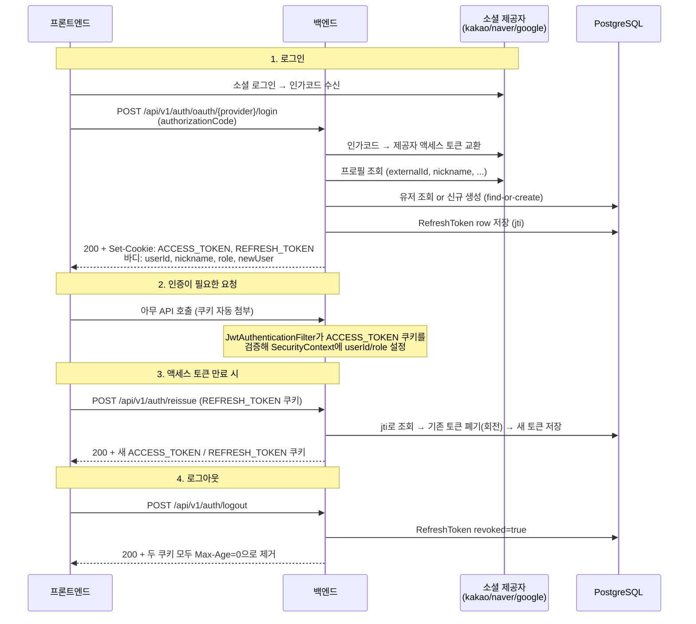

# 인증 (로그인 · JWT 쿠키 · 토큰 재발급)

이 문서는 `domain/auth`의 로그인/인증 로직을 처음 보는 팀원을 위한 안내서다.
"왜 이렇게 결정했는가"는 [ADR-0006](adr/0006-jwt-cookie-auth.md)에, 레이어/패키지 규칙은
[architecture.md](architecture.md)에 있다. 이 문서는 "무엇이 어디서 어떻게 동작하는가"를 다룬다.

## 한 줄 요약

**소셜 로그인(카카오/네이버/구글)으로 사용자를 식별하고, 우리 서버가 자체 발급한
JWT(액세스 + 리프레시)를 HttpOnly 쿠키에 담아 인증한다.** 비밀번호는 없다 — 계정은
전부 외부 OAuth 기반이다.

## 전체 흐름



## 코드 지도

전부 `domain/auth` 아래에 있다 (유저 엔티티/레포지토리만 `domain/user` 것을 빌려 쓴다).

| 위치 | 클래스 | 역할 |
|---|---|---|
| `controller/` | `AuthController` | 로그인/로그아웃/재발급 3개 엔드포인트. 쿠키 설정도 여기서 |
| `controller/docs/` | `AuthControllerDocs` | Swagger 문서 전용 인터페이스 (구현체에서 어노테이션 분리) |
| `service/` | `AuthService` | 로그인(find-or-create), 토큰 발급/회전/폐기의 핵심 로직 |
| `client/` | `SocialOAuthClient` / `RestClientSocialOAuthClient` | 인가코드 → 제공자 토큰 → 프로필 조회. 제공자별 분기 처리 |
| `jwt/` | `JwtProvider` | JWT 생성/파싱/검증 (jjwt 라이브러리) |
| `jwt/` | `CookieProvider` | HttpOnly 쿠키 생성/삭제. 쿠키 이름 상수(`ACCESS_TOKEN`, `REFRESH_TOKEN`)의 원본 |
| `jwt/` | `JwtAuthenticationFilter` | 매 요청마다 액세스 토큰 쿠키를 읽어 SecurityContext 채움 |
| `jwt/` | `JwtProperties` / `JwtConfig` | `jwt.*` 설정 바인딩 (secret, 만료시간, cookie-secure) |
| `jwt/` | `TokenPair` | (accessToken, refreshToken) 값 묶음 record |
| `entity/` | `RefreshToken` | 발급된 리프레시 토큰의 서버측 기록 (아래 상세) |
| `repository/` | `RefreshTokenRepository` | jti 조회, 유저 단위 일괄 폐기 |
| `converter/` | `AuthConverter` | entity ↔ dto 변환 |
| `enums/` | `SocialProvider` | KAKAO/NAVER/GOOGLE + 문자열 파싱 |
| `exception/` | `AuthErrorCode` | `AUTH...` 에러 코드 (아래 표) |

## 토큰 설계

| | 액세스 토큰 | 리프레시 토큰 |
|---|---|---|
| 수명 | 30분 (`jwt.access-token-expiration-ms`) | 14일 (`jwt.refresh-token-expiration-ms`) |
| 전달 | `ACCESS_TOKEN` HttpOnly 쿠키 | `REFRESH_TOKEN` HttpOnly 쿠키 |
| 클레임 | `sub`(userId), `type=access`, `role` | `sub`(userId), `type=refresh`, `jti`(UUID) |
| 서버측 저장 | 없음 (stateless) | `refresh_token` 테이블에 jti만 저장 |
| 용도 | API 요청 인증 | 새 토큰 쌍 재발급 |

포인트:

- **토큰은 응답 바디에 절대 담지 않는다.** 쿠키가 HttpOnly라 JS에서 읽을 수 없고,
  그게 의도다(XSS로 토큰을 훔칠 수 없음). 프론트는 요청에 `credentials: 'include'`만
  붙이면 된다.
- `type` 클레임으로 액세스/리프레시를 구분한다. 리프레시 토큰을 액세스 토큰 자리에
  넣어도 `JwtProvider.parseAccessClaims()`가 거부한다 (반대도 마찬가지).
- 서명은 HS256 대칭키(`jwt.secret`). dev는 yml 기본값이 있고, **prod는 `JWT_SECRET`
  환경변수가 필수**다 (없으면 부팅 실패 — 의도된 동작).

## 리프레시 토큰 저장 · 회전 · 재사용 탐지

### 왜 서버에 저장하나?

JWT만으로는 "로그아웃했으니 이 토큰 무효" 처리를 할 수 없다. 그래서 리프레시 토큰
발급 시 `refresh_token` 테이블에 기록을 남긴다. **토큰 원문이 아니라 jti(UUID)만
저장**하므로 DB가 유출돼도 토큰 자체는 복원할 수 없다.

```
refresh_token
├─ token_id   : JWT의 jti 클레임 (UNIQUE) — 조회 키
├─ user_id    : 소유자
├─ expires_at : 만료 시각
├─ revoked    : 폐기 여부 (로그아웃/회전/재사용탐지 시 true)
└─ version    : 낙관적 락 (동시 재발급 경합 방지)
```

Redis가 아니라 DB인 이유: 현 시점 Redis는 미구성 상태라 이 목적만으로 인프라를
추가하는 건 과했다. 상세는 [ADR-0006](adr/0006-jwt-cookie-auth.md).

### 회전(rotation)

`/reissue`를 호출하면 제시된 리프레시 토큰은 **그 자리에서 폐기**되고 새 쌍이
발급된다. 즉 리프레시 토큰은 일회용이다.

### 재사용 탐지

이미 폐기된(revoked) 토큰이 다시 들어오면 탈취로 간주한다:

1. `AuthService.reissue()`가 `revoked=true`인 row를 발견
2. **해당 유저의 모든 리프레시 토큰을 일괄 폐기** (`revokeAllByUserId`)
3. `AUTH401_4` 반환 → 모든 기기에서 재로그인 필요

공격자와 정상 사용자 중 누가 진짜인지 알 수 없으므로 둘 다 로그아웃시키는 게
표준적인 대응이다.

### 동시 재발급 경합 (주의 깊게 볼 것)

같은 리프레시 토큰으로 **동시에 두 요청**이 오면 (프론트의 401 인터셉터 중복 호출,
다중 탭 등) 둘 다 `revoked=false`로 읽고 둘 다 성공할 수 있다. 이를 막으려고:

- `RefreshToken`에 `@Version` 낙관적 락을 뒀고,
- `reissue()`가 `saveAndFlush()`로 폐기를 즉시 flush한다. 늦은 쪽 트랜잭션은
  `OptimisticLockingFailureException`이 나고, 이를 재사용과 동일하게 처리한다.
- `RefreshTokenRepository.revokeAllByUserId`는 `@Transactional(propagation = REQUIRES_NEW)`다.
  실수가 아니다 — 두 가지 이유가 있다.
  1. 낙관적 락 충돌 직후의 Hibernate Session은 flush 실패로 신뢰할 수 없는 상태라
     (Hibernate 공식 권고), 같은 트랜잭션으로 계속 작업을 이어가면 안 된다.
  2. `reissue()`가 곧이어 `REFRESH_TOKEN_REUSED` 예외를 던지는데, 그게 이 메서드
     자신의 트랜잭션은 롤백시켜도 REQUIRES_NEW로 이미 커밋된 무효화 조치엔 영향이 없어야 한다.

  **지우거나 REQUIRED로 되돌리지 말 것.**

> 프론트 구현 시: 401 → reissue 호출은 반드시 큐잉/디듀프해야 한다. 동시에 두 번
> 쏘면 정상 사용자도 재사용 탐지에 걸려 전체 로그아웃된다.

## API 요약

베이스: `/api/v1/auth` · 응답은 전부 `ApiResponse<T>` 봉투. Swagger UI(`/swagger-ui.html`)에 상세 스펙 있음.

| 메서드/경로 | 하는 일 | 성공 | 주요 실패 |
|---|---|---|---|
| `POST /oauth/{provider}/login` | 인가코드로 로그인(최초면 자동 가입) + 토큰 쿠키 발급 | 200, 바디에 유저 정보 | `AUTH400_1` 미지원 provider, `AUTH400_2` 잘못된 인가코드, `AUTH502_*` 제공자 통신 실패 |
| `POST /reissue` | 리프레시 토큰 검증 → 회전 → 새 쿠키 발급 | 200, 바디 없음 | `AUTH401_2` 무효 토큰, `AUTH401_3` 쿠키 없음, `AUTH401_4` 재사용 탐지 |
| `POST /logout` | 리프레시 토큰 폐기 + 쿠키 제거 | **항상 200** (쿠키 없어도, 토큰이 무효여도) | — |

에러 코드 전체는 `domain/auth/exception/AuthErrorCode.java`. 참고로 `AUTH401_1`은
`GeneralErrorCode.UNAUTHORIZED`가 선점하고 있어 auth 도메인 코드는 `AUTH401_2`부터 시작한다.

## 요청 인증은 어떻게 되나 (JwtAuthenticationFilter)

`SecurityConfig`가 `JwtAuthenticationFilter`를 필터 체인에 등록해 두었다. 매 요청마다:

1. `ACCESS_TOKEN` 쿠키를 찾는다 (없으면 그냥 통과)
2. 서명/만료/type 검증에 성공하면 `SecurityContext`에
   `UsernamePasswordAuthenticationToken(principal=userId(Long), authorities=[ROLE_USER|ROLE_ADMIN])`을 채운다
3. **검증 실패해도 요청을 막지 않는다** — 401을 결정하는 건 필터가 아니라 인가 정책의 몫

⚠️ **현재 인가는 미구현이다.** `SecurityConfig`가 `anyRequest().permitAll()`이라
토큰 없이도 모든 API가 열려 있다. 보호가 필요한 API가 생기면 그때
`authenticated()`/`hasRole()`로 잠근다. 컨트롤러에서 로그인 유저 ID가 필요하면
`SecurityContextHolder`의 principal(= `Long` userId)을 쓰면 된다.

## 설정

```yaml
# application.yml (공통)
jwt:
  access-token-expiration-ms: 1800000      # 30분
  refresh-token-expiration-ms: 1209600000  # 14일
  cookie-secure: false                     # prod에선 true

# application-dev.yml — 로컬용 secret 기본값 있음
jwt:
  secret: ${JWT_SECRET:local-dev-only-...}

# application-prod.yml — secret 필수, secure 쿠키
jwt:
  secret: ${JWT_SECRET}
  cookie-secure: ${JWT_COOKIE_SECURE:true}
```

소셜 로그인 키(`KAKAO_CLIENT_ID` 등)는 `app.oauth.*`로 별도 관리된다 (`.env` 참고).
**주의: `.env` 파일은 IntelliJ Run Configuration에서만 읽힌다.** 터미널에서
`./gradlew build`를 돌릴 땐 OS 환경변수로 직접 넣어야 한다
(예: `$env:DB_PORT='5433'; ./gradlew build`).

## 로컬에서 만져보기

실제 소셜 로그인은 제공자 앱 키가 필요해서 curl로 전 구간을 돌리긴 어렵다.
토큰 로직은 유닛 테스트로 확인하는 게 빠르다:

```bash
# 회전/재사용탐지/경합 시나리오 포함
./gradlew test --tests "*.AuthServiceTest" --tests "*.AuthControllerTest"
```

엔드포인트 자체는 앱 띄우고 바로 확인 가능:

```bash
docker compose up -d && ./gradlew bootRun   # DB 포트 다르면 DB_PORT 환경변수

curl -i -X POST http://localhost:8080/api/v1/auth/reissue   # → 401 AUTH401_3
curl -i -X POST http://localhost:8080/api/v1/auth/logout    # → 200 + 쿠키 제거
```

DB에 쌓인 토큰 확인:

```bash
docker compose exec db psql -U postgres -d jejugilmoa \
  -c "select id, user_id, left(token_id,8) jti, revoked, expires_at from refresh_token order by id desc limit 10;"
```

## 알려진 한계 / TODO

- **인가 미구현** — 전 요청 permitAll. 보호 대상 API가 생기면 잠글 것 (위 참조)
- **만료/폐기된 `refresh_token` row 정리 배치 없음** — 로그인/재발급마다 row가 쌓인다.
  `RefreshTokenRepository`에 TODO 주석 있음
- **CSRF disable 상태** — 현재는 위험이 낮지만, 프론트 도메인이 백엔드와 same-site가
  아니게 되어 `SameSite=None`으로 바꿔야 하는 순간 재검토 필요
- `JwtProvider`/`CookieProvider`/`JwtAuthenticationFilter` 단위 테스트 없음
  (서비스/컨트롤러 테스트로 간접 커버만 됨)


## iOS 네이티브 Apple 로그인 (1차)

`POST /api/auth/apple/login`은 인증 없이 호출하며 기존 인가코드 endpoint와 분리한다.

```json
{
  "identityToken": "Apple에서 받은 identityToken",
  "rawNonce": "로그인 시도마다 생성한 충분히 긴 난수 문자열"
}
```

- `identityToken`: 필수, 최대 16,384자.
- `rawNonce`: 필수, 32~256자. 앱에서 CSPRNG 난수 32바이트를 생성하고 Base64URL 문자열로
  표현하는 방식을 권장한다. 입력값을 trim하거나 정규화하지 않는다.
- 앱은 `SHA-256(rawNonce의 UTF-8 바이트)`의 **소문자 hex(64자)**를 Apple 인증 요청의
  nonce로 지정한다. 서버에는 해시 전 `rawNonce`를 보낸다. nonce 비교는 상수 시간 비교를 사용한다.
- `audience`, `sub`, 이메일, role을 별도 입력으로 받지 않는다.

호출 흐름:

```text
AuthController.appleLogin
 → AppleAuthService
 → AppleIdentityTokenVerifier (AppleJwtIdentityTokenVerifier)
 → AppleJwksClient (서버 설정의 공개키 endpoint)
 → 검증된 AppleIdentityClaims
 → AuthConverter.toUserInfo (APPLE, sub, 애플 사용자, null, 검증된 이메일)
 → AuthService.loginWithVerifiedIdentity
 → 기존 활성 회원 조회 / 탈퇴 회원 복구 / 가입 / 누락 이메일 보충
 → AuthService.issueTokens
 → CookieProvider
 → ApiResponse<OAuthLoginResponse>
```

기존 카카오/네이버/구글은 기존 `SocialOAuthClient`로 신원을 확인한 후 같은 공통 진입점을 사용한다.
`/api/auth/oauth/apple/login`은 지원하지 않으며 `AUTH400_1`로 거부한다.
Apple JWT는 서비스 자체 `JwtProvider`로 검증하지 않는다.

### 응답과 앱의 쿠키 처리

```json
{
  "isSuccess": true,
  "code": "COMMON200",
  "message": "성공적으로 요청을 처리했습니다.",
  "result": {
    "userId": 123,
    "nickname": "애플 사용자",
    "profileImageUrl": null,
    "role": "USER",
    "newUser": true
  }
}
```

기존과 동일하게 `ACCESS_TOKEN`, `REFRESH_TOKEN`을 HttpOnly cookie로 발급한다.
앱은 Set-Cookie를 저장하고 이후 인증 API, `/api/auth/reissue`, `/api/auth/logout`에 전송해야 한다.
토큰은 response body에 넣지 않는다. `Secure` 여부는 기존 `JWT_COOKIE_SECURE` 설정을 따른다.

### 환경변수

| 변수 | 기본값 | 설명 |
|---|---|---|
| `APPLE_ISSUER` | `https://appleid.apple.com` | 정확히 일치해야 하는 issuer |
| `APPLE_JWKS_URI` | `https://appleid.apple.com/auth/keys` | 서버가 신뢰하는 공개키 주소 |
| `APPLE_ALLOWED_AUDIENCES` | 빈 값 | 허용 iOS Bundle ID. 여러 개면 쉼표 구분 |

실제 Bundle ID는 기본값으로 추측하지 않는다. audience 미설정 시 Apple 요청만
`AUTH500_1`로 거부하며 기존 제공자 로그인을 유지한다.
Spring Boot는 `.env`를 자동으로 읽지 않으므로 실행 환경에 직접 주입해야 한다.
운영 환경에서는 Apple의 issuer/JWKS 기본값을 유지한다. HTTP JWKS는 로컬 테스트에만 허용한다.

### 검증·공개키 정책

- `kid` 필수 및 256자 제한, `alg=RS256`만 허용, unsigned/HMAC token 거부.
- token이 지정한 `jku`/`x5u` 주소는 사용하지 않는다. 압축 JWT도 거부한다.
- RSA 서명 검증 후 issuer, audience, 필수 expiration, nonce, sub(필수/255자 이하)를 검사한다.
- 만료 시계 오차는 허용하지 않는다. 서버 시각은 NTP로 동기화한다.
- `email_verified`가 boolean `true` 또는 문자열 `"true"`인 이메일만 사용한다.
  이메일이 없거나 미검증이면 null로 처리한다. 이메일로 계정을 자동 병합하지 않는다.
- 공개키 캐시 TTL 1시간, 전체 갱신 최소 간격 30초. 알 수 없는 kid는 갱신 가능 시 재조회한다.
  갱신 직후 새 키가 나타나면 최대 30초 후 재시도가 필요할 수 있다.
- 연결 timeout 3초, 응답 timeout 5초, HTTP redirect는 따라가지 않는다.
- 공개키 조회 실패 시 만료된 캐시로 인증하지 않는다. 유효기간 내 이미 알고 있는 키는 계속 사용할 수 있다.

| 코드 | HTTP | 의미 |
|---|---|---|
| `AUTH401_5` | 401 | Apple token 서명/header/claim 무효 또는 공개키 조회 후 kid 없음 |
| `AUTH401_6` | 401 | Apple token 만료 |
| `AUTH401_7` | 401 | nonce 누락 또는 불일치 |
| `AUTH502_2` | 502 | JWKS 통신 장애 또는 공개키 응답 오류 |
| `AUTH500_1` | 500 | Apple 설정 누락/오류 |

### 후속 보안·운영 이슈

1. 이번 범위에는 서버 nonce challenge 및 Redis replay 저장소가 없다.
   nonce 해시 비교는 동일한 token/rawNonce의 재전송을 막지 않으며, token 만료 전 재사용이 가능하다.
   앱은 매 로그인 시도마다 새로운 nonce를 생성한다. 서버 측 일회성 소비는 후속 작업이다.
2. Apple 권한 철회 감지, Apple refresh token/code 교환 및 token revoke는 미구현이다.
   자체 refresh token 회전이 Apple 측 철회를 감지하는 것은 아니다.
3. 배포 전 실제 Bundle ID/Sign in with Apple capability와 iOS 쿠키 유지·재발급을 실기기에서 확인한다.
4. 운영 HTTPS 및 Secure cookie 설정, 로그인 rate limit, JWKS 장애·키 갱신 모니터링을 확인한다.
   identityToken/rawNonce/JWT 원문은 로그에 기록하지 않는다.

자동화 검증은 테스트용 RSA 키와 로컬 JWKS stub을 사용한다. 실제 Apple 계정에 의존하지 않는다.
